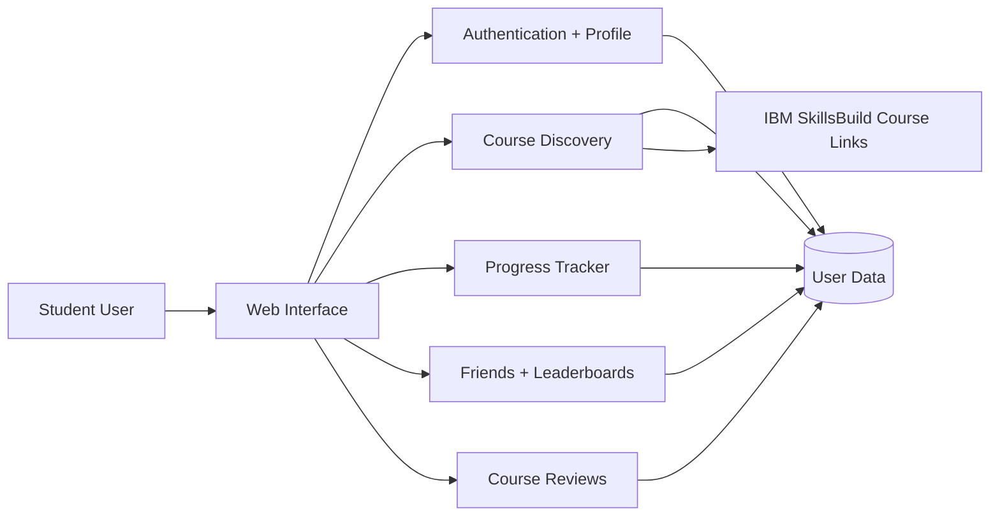
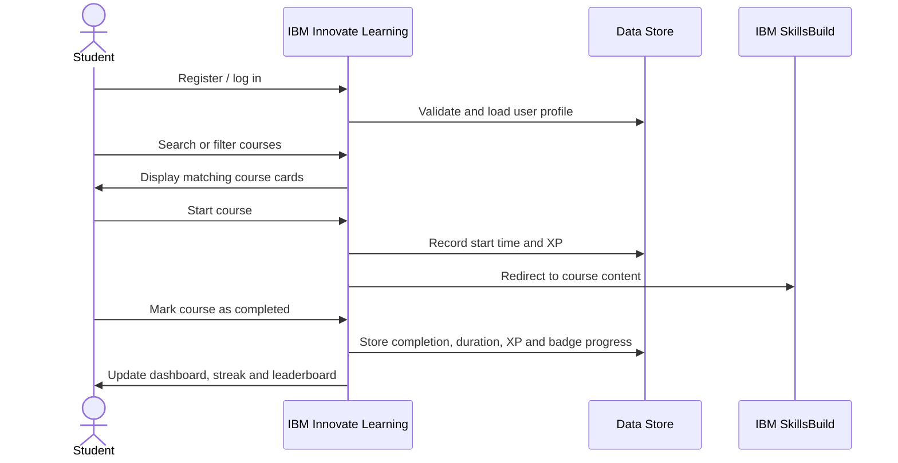

# IBM Innovate Learning


A full-stack learning platform built to help students discover IBM SkillsBuild courses, track learning progress, maintain streaks, earn XP, collect badges, review courses, and compare progress with friends through leaderboards.

This was developed as a university team software engineering project, with a strong focus on **user-centred design, Agile delivery, testing, GitLab issue tracking, and practical learning features**.

---

## Why this project matters

Online learning platforms can feel passive: users browse courses, start something, forget where they left off, and lose motivation. IBM Innovate Learning was designed to make learning more structured and motivating by combining course discovery with progress tracking, gamification, social comparison, and profile personalisation.

The platform supports users through the full learning journey:

1. Register or log in securely.
2. Discover IBM SkillsBuild courses using search and filters.
3. Start a course and track learning activity.
4. Pause, resume, and complete courses.
5. Earn XP, badges, streaks, and leaderboard rankings.
6. Add friends and compare progress.
7. Submit course reviews and manage profile/avatar details.

---

## Key features

### Authentication and user accounts
- Register and log in to access a personalised dashboard.
- Form validation for email, passwords, and repeated details.
- Password reset flow using an email OTP process.
- Google sign-in flow included in the user journey.

### Course discovery
- Browse IBM SkillsBuild-style learning courses.
- Search by course name, tag, or duration.
- Filter by area of interest such as AI, Cybersecurity, Data Science, or Cloud.
- Filter by course language.
- Course cards display duration, language, descriptions, and learning actions.


### Dashboard and progress tracking
- Personalised dashboard showing completed courses, courses in progress, and current streak.
- Dedicated progress tracker for ongoing and completed courses.
- Course start time, completion time, duration, and read count are recorded.
- Users can pause and resume learning to maintain accurate time tracking.


### Gamification
- XP rewards for starting and completing courses.
- Daily login reward and streak logic.
- Badges for learning milestones and social engagement.
- Achievement cards and treasure-map style progress feedback.


### Friends and leaderboards
- Send, accept, decline, and remove friend requests.
- View accepted friends in a dedicated friends dashboard.
- Compare progress using friend leaderboard XP bars.
- Global leaderboard ranks users by XP.


### Reviews
- Submit reviews for courses.
- Star rating and written feedback workflow.
- Validation for empty reviews.
- Review display section for user feedback.


---

## Technical overview

> Adjust this section if your final implementation uses slightly different package names or commands.

| Area | Technologies / practices |
|---|---|
| Backend | Java, Spring Boot / Spring MVC |
| Frontend | HTML, CSS, JavaScript, server-rendered web pages |
| Data | SQL-based persistence and Firebase-supported workflows |
| Collaboration | GitLab, Git, issue boards, sprint backlog, merge workflow |
| Testing | Manual feature testing, integration testing, user-story validation, defect reporting |
| Delivery | Agile/Scrum, sprint planning, backlog grooming, retrospectives, user manual documentation |

---

## Architecture



---

## Core user flow



---

## Agile delivery and teamwork

This project was delivered using Scrum-style teamwork with issue tracking, sprint backlogs, prioritisation and review stages. The team used GitLab boards to move work through development, testing, review and completion.


### My contribution

My role focused on Scrum coordination, testing, repository workflow support, and delivery organisation:

- Managed GitLab issue boards and sprint backlog items.
- Helped assign weighted user stories and clarify dependencies.
- Reminded the team to keep repositories and Scrum boards updated.
- Supported Git/GitLab workflows, merge coordination and repository updates.
- Tested features developed by other team members after they were integrated into the system.
- Documented testing outcomes, sprint progress, and system improvements in project reports.
- Helped identify Git, merge, compilation and integration issues during delivery.

---

## Testing and QA

Testing was treated as part of delivery, not an afterthought. Features were checked against expected outcomes and moved through review before being considered complete.

Testing covered:

- Registration and login validation.
- Course search and filtering.
- Progress tracking and course completion.
- Friends requests and leaderboard updates.
- Streak and XP behaviour.
- Profile and avatar updates.
- Review submission validation.
- Error handling for invalid user actions.


Example test areas:

| Feature | Expected behaviour |
|---|---|
| Friend request | Valid request appears as pending and can be accepted/declined |
| Leaderboard | Users are sorted by XP and updated after course progress |
| Course completion | Completed courses move from ongoing to completed list |
| Reviews | Empty review input is blocked and valid reviews are displayed |
| Streaks | Streak increases only after meaningful learning activity |

---

## What this project demonstrates

This project is valuable for recruiters because it shows more than just code. It demonstrates the ability to work inside a realistic team-based software delivery environment.

### Software engineering skills
- Full-stack web application development.
- Backend integration with persistent user data.
- User journeys from registration through to completion.
- State management for progress, XP, badges, streaks and social features.
- Testing and verification of integrated features.

### Team delivery skills
- Agile/Scrum ceremonies and sprint planning.
- Backlog management and issue tracking.
- GitLab workflow and repository coordination.
- Cross-team testing and documentation.
- Communication of blockers, dependencies and progress.

### Product thinking
- Designed around student motivation and course completion.
- Includes gamification to encourage consistent learning.
- Uses social comparison through friends and leaderboards.
- Provides a user manual to support onboarding and usability.

---

## Running the project locally

> These commands assume a Spring Boot/Maven-style project. Update the commands if your repository uses a different build tool.

```bash
# Clone the repository
git clone https://github.com/rien1230/IBMInnovateLearning.git
cd IBMInnovateLearning

# Run the application
./mvnw spring-boot:run
```

If Maven is installed globally:

```bash
mvn spring-boot:run
```

Then open the local application in your browser:

```text
http://localhost:8080
```

---

## Suggested repository structure

```text
IBMInnovateLearning/
├── src/
│   ├── main/
│   │   ├── java/              # Application controllers, models and services
│   │   └── resources/         # Templates, static assets and configuration
│   └── test/                  # Test files
├── docs/                      # User manual, sprint notes, testing evidence
├── assets/readme/             # README screenshots
├── README.md
└── pom.xml / build.gradle
```

---

## Future improvements

If continued beyond the coursework version, the next improvements would be:

- Add automated test coverage for the most important user journeys.
- Improve UI consistency and responsive design across all pages.
- Add stronger role-based access control for users/admins.
- Improve course recommendation logic using user interests and progress history.
- Add analytics for completion rates, streak retention and course popularity.
- Add CI/CD checks for build, test and deployment quality.


---

## Summary

IBM Innovate Learning is a full-stack learning platform that combines course discovery, progress tracking, gamification, friends, leaderboards, reviews and profile personalisation. It demonstrates software engineering delivery, Agile teamwork, GitLab workflow, testing discipline and user-focused product development.
